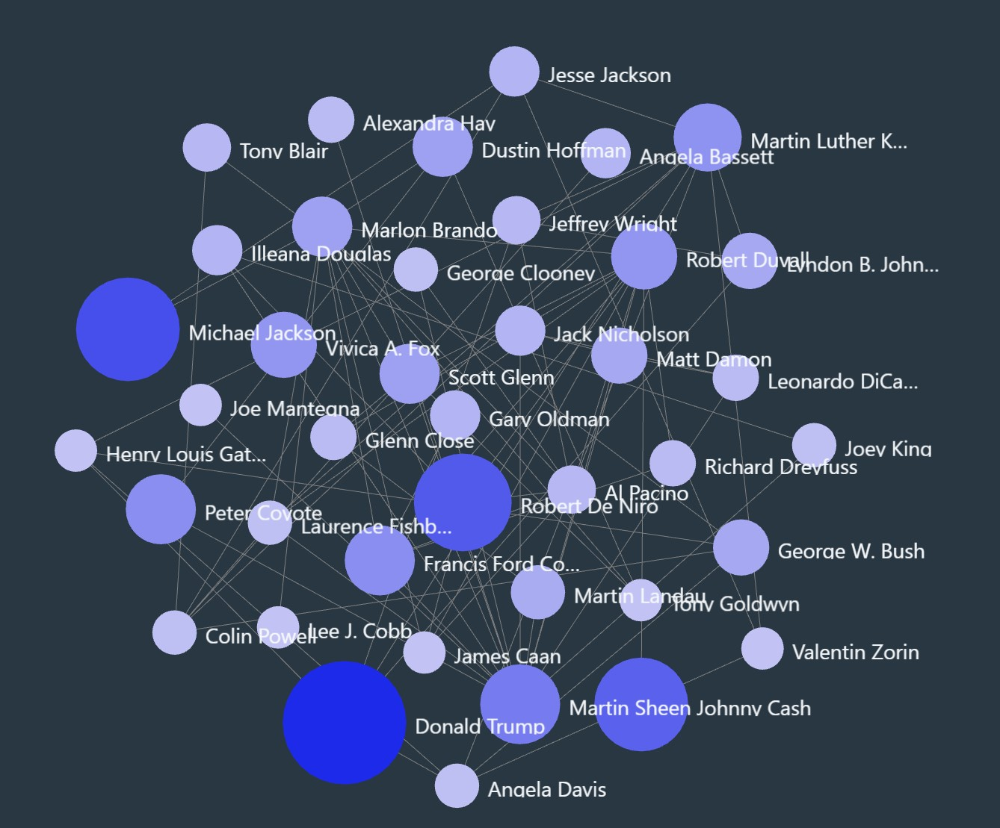

<h2>Collect data from TMDb and visualize co-actor network</h2>

 Adopted from the Georgia Tech Data and Visual Analytics course that I attended in Q1 2021, I collected data using an API for The Movie Database (TMDb) and constructed a graph representation of this data that shows which actors have acted together in various movies, and used Argo Lite to visualize the graph. 
The following steps has been undertaken into the Python code: 

<ol>
<li>	Implementation of the Graph class  </li>
<li>	Implementation of the TMDbAPIUtils class </li>
<li>  Producing nodes.csv and edges.csv. Those two files need then to be uploaded  
to Argo-Lite website.</li>
<li> Visualizing a graph of co-actors using Argo-Lite </li>
</ol>
 

<a href='Visualizing_a_graph.ipynb'>Collect data from TMDb and visualize co-actor network</a>

 

  
 <kbd></kbd>

<h3> Reference: </h3>
<ol>
<li> <a href="https://omscs.gatech.edu/cse-6242-data-visual-analytics">CSE 6242: Data and Visual Analytics </a> </li>
</ol>
