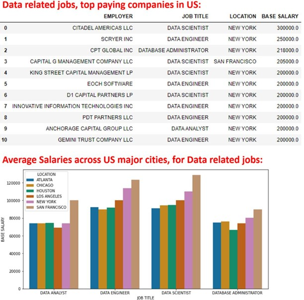

<h2>US Data Related Job Salaries</h2>

Adopted from an exercise from the course CSE 6040, Computational Data Analytics, I used the available data, from the website H1B Visa Salary Database., to find out how much overall data science experts get paid in US, 
and whether their salaries vary across major cities, and which companies pays the most.

Companies have submitted petitions on what base salaries they are proposing to pay, and where the workers will work. 
Such information is readily available in the website, aggregated from 2013-2022,<a href='https://h1bdata.info/index.php'>Search Salary Now</a>, and while it applies to foreign workers only, 
I think the trends may still fulfill the initial purpose.
Based on this analysis, San Francisco is the city that pays most and ‘CITADEL AMERICAS LLC‘, ‘ SCRYER INC ‘ and ‘CPT GLOBAL INC ‘are 
 among the highest paying companies.

I also surprisingly observed that job titles Data Engineer or Data Scientist earn more than Data Analyst.

 

  
 <kbd></kbd>

 

<b>The above analysis was performed during Dec 2022</b>

I believe similar analysis can be applied to any other job groups as the input data available to public. 
  Pls feel free to contact me if you like to see the python codes, for deriving and analyzing such information.

